___

# Medidor de CO2   
 
Este repositorio público documenta los detalles técnicos de la construcción de un medidor sencillo, portable, de bajo costo y *no comercial* de concentración de dióxido de carbono (CO2) en el aire usando un sensor de CO2 específico de tipo NDIR (infrarojo no dispersivo), una placa Arduino y otros accesorios comunes. Incluye los detalles del hardware, con sus componentes y circuitos asi como del software usado para controlar, mediante una placa Arduino, la adquisición de datos del sensor y la actuación sobre dispositivos de salida como pantallas, bocinas, y puerto serial. Software adicional permite leer el puerto serial para un análisis más detallado de las series temporales, en forma local o remota, textual o gráfica. El medidor propuesto es minimalista y puede servir de base para modelos más sofisticados. 

Este proyecto propuesto puede ser perfectamente realizado por no especialistas, idealmente por aficionados o "makers" de cualquier nivel. No requiere conocimientos profundos de electrónica, ni de programación, ni de matemática, ni de física. Sólo se necesita un soldador y un poco de estaño para realizar un par de soldaduras muy sencillas, y una computadora con cualquier sistema operativo con algún Arduino IDE instalado. La comunidad del software y hardware libre es tan grande y generosa que ante cualquier duda basta saber googlear perseverantemente para encontrar una respuesta en la mayoría de los casos. Lo más dificil de este proyecto es adquirir los sensores NDIR de CO2 ya que, por ahora, en Argentina, hay que importarlos. El resto de los componentes se pueden conseguir, y usualmente hay stock, en tiendas locales de Argentina. 

El proyecto completo consistió en el armado de 5 medidores idénticos para medir la calidad del aire en la ciudad de San Carlos de Bariloche, en particular en institutos, laboratorios y escuelas. Las mediciones y experimentos serán recopilados en un blog. Con este sencillo proyecto nos sumamos a la [campaña ventilar](https://www.argentina.gob.ar/ciencia/unidad-coronavirus/ventilar) desde San Carlos de Bariloche.

<!--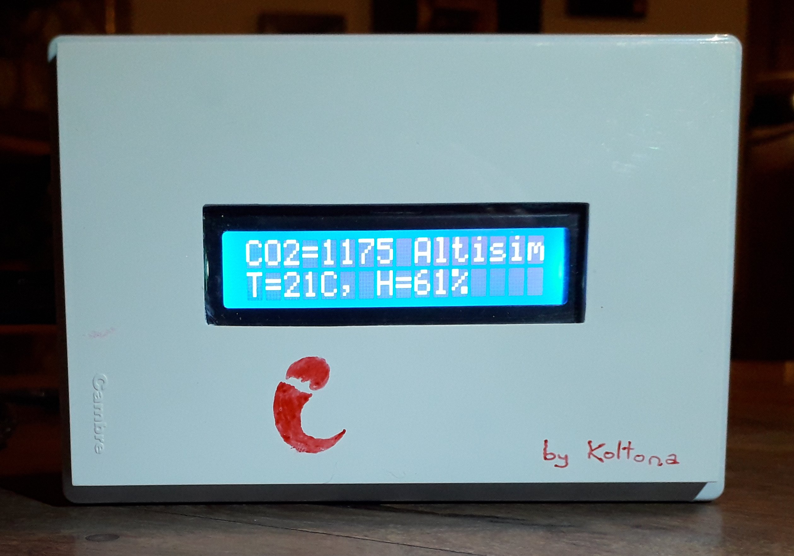-->
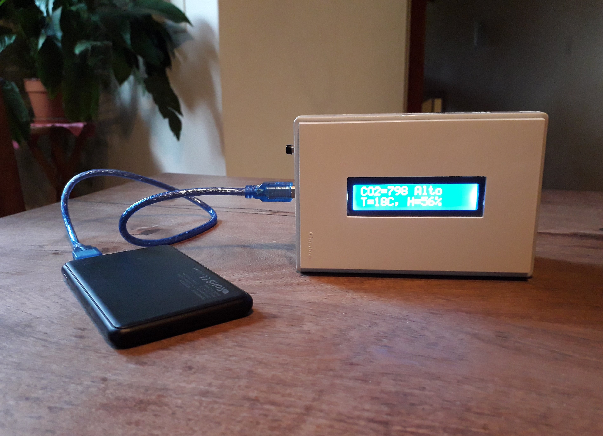

___

# Contenidos
1. [Motivación](#motivación)
   1. [COVID19](#covid19)
   2. [¿Por qué medir CO2?](#por-qué-medir-co2)
   3. [¿Qué concentración de CO2?](#qué-concentración-de-co2)
   4. [¿Cuántos cambios de aire?](#cuántos-cambios-de-aire)
   5. [¿Estoy ventilando bien?](#estoy-ventilando-bien)
   6. [Preguntas frecuentes](#preguntas-frecuentes)
   7. [Argentina](#argentina)
2. [Medidor](#medidor)
   1. [Funcionalidad](#funcionalidad)
   2. [Uso](#uso) 
   3. [Lista de Componentes](#lista-de-componentes)
   4. [Circuito](#circuito)
   5. [Software](#software)
   6. [Ensamblaje](#ensamblaje)
3. [Proyectos Parecidos](#proyectos-parecidos)
4. [Agradecimientos](#agradecimientos)
5. [Contacto](#contacto)

___
 
# Motivación

## COVID19

El covid19 se contagia principalmente por [vía aérea](https://www.thelancet.com/journals/lancet/article/PIIS0140-6736(21)00869-2/fulltext#.YILw1d1ShYA.twitter), a través de la exhalación de aerosoles por personas infectadas (¡típicamente asíntomáticas o presintomáticas!), y la consiguiente inhalación de estos aerosoles contaminados por personas susceptibles. Cuando inhalamos aerosoles, algunas de estas gotitas se pueden [adherir a nuestros tractos respiratorios](https://www.nature.com/articles/s42254-021-00307-4). Existe luego una probabilidad finita de que el virus, aún activo, se libere del interior de una de esas gotitas y alcance los [receptores](https://www.sciencedirect.com/science/article/abs/pii/S0092867420306759) que propician su multiplicación, con las conocidas consecuencias en la salud de las personas. 

Los aerosoles que pueden potencialmente transportar carga viral están constituidos por un [espectro de partículas micrométricas](https://www.sciencedirect.com/science/article/pii/S0021850208002036#fig4) que pueden permanecer en el aire desde decenas de segundos hasta muchas horas (análogo al polen por ejemplo). En exteriores, los aerosoles exhalados por un infectado sólo pueden ser inhalados por personas a pequeña distancia, ya que a gran distancia se diluyen rápidamente. En interiores, sin embargo, existen ambas, las rutas denominadas de [corto y de largo alcance](https://www.ajicjournal.org/article/S0196-6553(16)30531-4/pdf). Mientras que [la ruta de corto alcance](https://www.sciencedirect.com/science/article/pii/S0360132320302183) se puede controlar manteniendo una prudencial distancia, la ruta de largo alcance depende crucialmente de los [sistemas de ventilación](https://www.rehva.eu/fileadmin/user_upload/REHVA_COVID-19_guidance_document_V4.1_15042021.pdf). [Compartiendo una sala con una o más personas infectadas](https://english.elpais.com/society/2020-10-28/a-room-a-bar-and-a-class-how-the-coronavirus-is-spread-through-the-air.html?rel=mas), la dosis total de exposición al virus es igual al producto de su concentración por el tiempo. Para reducir el riesgo de contagio en interiores, además de usar barbijos capaces de filtrar aerosoles en los dos sentidos (exhalados e inhalados), la ventilación debe aumentarse y el tiempo y densidad de ocupación debe ser reducido, tanto más cuanto más fuerte sea la actividad desarrollada en el lugar, ya que esta determina la tasa volumétrica de respiración de los ocupantes. Cuanto más volumen de aire exhalemos e inhalemos en cada respiración, mayor cantidad de aerosoloes serán exhalados e inhalados.

La OMS tardó, pero reconoció [recientemente](https://youtu.be/oqFn6AHoJZQ) la gran importancia de los aerosoles en la transmisión de corto y largo alcance del covid19.   

## ¿Por qué medir CO2?
La concentración de CO2 es un [proxy](https://pubs.acs.org/doi/10.1021/acs.estlett.1c00183) a la concentración potencial de virus activo en los aerosoles exhalados. Una concentración de CO2 muy por encima del valor del exterior implica mucho aire ya respirado y una concentración potencialmente alta de virus, aunque  esta última también depende del número de personas infectadas en el lugar y de su infectividad, de la calidad y uso de los [tapabocas](https://science.sciencemag.org/content/early/2021/05/19/science.abg6296) por los ocupantes, de la existencia de filtros de aire, y de otras condiciones físicas (humedad, temperatura, radiación ultravioleta, etc). 

Aún sin conocer cuanto virus hay en el aire está claro que el riesgo está en [respirar aire ya respirado por otro](https://youtu.be/ZMRyWUjleB0). Cuando respiramos, en la inhalación llevamos a los pulmones aire que contiene un 78% de nitrógeno, 20.95% de oxigeno, cantidades más pequeñas de otros gases y aerosoles que pueden transportar patógenos de distinta proveniencia. Cuando lo exhalamos el aire contiene un 5.0–6.3% de vapor de agua, 79% nitrógeno, 13.6–16.0% oxígeno, 4.0–5.3% de dióxido de carbono CO2, otros gases en menor cantidad y aerosoles que pueden transportar patógenos que tengamos adentro nuestro. Parte del oxígeno que inhalamos va a la sangre que lo lleva y distribuye a las células a través del sistema circulatorio. El CO2 que liberan las células como resultado de la respiración celular es transportado en camino inverso hacia los pulmones y cuando exhalamos liberamos aire con una concentración de CO2 del orden de 4% o 40000 partes por millón (ppm). Si no existen otras fuentes de CO2 en el ambiente el exceso de CO2 debido a la respiracón de las personas es fácil y rápidamente detectable mediante distintas técnicas. Por lo tanto, una forma fácil de saber que fracción del aire que estamos respirando ya fue respirado por otra persona es entonces medir la concentración de CO2 que está en *exceso* con respecto de su valor en el exterior. Este exceso depende fuertemente de las características de ventilación de la sala.

*Es importante insistir en que el medidor *no* nos dirá cuanto virus hay en el aire pero, si hay infectados en el interior, la concentración de virus en los aerosoles crecerá con la concentración de CO2, y este último servirá entonces como indicador de riesgo.*

## ¿Qué concentración de CO2?

Aunque existen [modelos teóricos](https://www.edx.org/es/course/physics-of-covid-19-transmission), es muy difícil hacer estimaciones precisas directamente de la probabilidad de contagio, debido a la gran incertidumbre de algunos paramétros necesarios para hacer las [predicciones cuantitativas](https://www.medrxiv.org/content/10.1101/2020.08.26.20182824v2.full) sobre la probabilidad de contagio. Una recomendación simplista pero muy práctica es mantener la concentración  de CO2 en un interior a valores < 800 ppm, que implica que el ~1% del aire que respiramos ya fue respirado (más precisamente es el exceso respecto del valor exterior de ~400 ppm el que determina ese 1%). Supone esta recomendación que se mantiene una distancia interpersonal que reduce el riesgo de contagio por transmisión de corto alcance, y que la ocupación es compartida por una duración estándar de algunas horas, la típica de clases o de trabajo de oficina, ya que la dosis total bajo exposición al virus es igual al producto de su concentración por el tiempo. El valor 800 ppm es por tanto algo arbitrario, pero práctico, al fijar un objetivo. Mas allá de la teoría de primeros principios, la estadística de contagios en interiores según la calidad del aire de los mismos podría refinar este número empíricamente en un futuro próximo.

*Es importante insistir en que *cualquier* exceso de CO2 con respecto del exterior es peligroso si hay incidencia y la exposición es muy prolongada.* 

## ¿Cuántos cambios de aire?
El número de cambios de aire por hora o ACH cuantifica la ventilación de un interior dado a priori. Si se puede medir CO2 en la sala desocupada, uno puede determinar el número de cambios de aire por hora o ACH cargando el ambiente con CO2 de forma controlada y monitoreando su descarga hacia el valor de equilibrio. El tiempo característico del decaimiento de la concentración de CO2 es el inverso del ACH. Ambas mediciones, la de las ppm de CO2 y el ACH [pueden relacionarse fácilmente](https://schools.forhealth.org/wp-content/uploads/sites/19/2020/08/Harvard-Healthy-Buildings-program-How-to-assess-classroom-ventilation-08-28-2020.pdf), permitiendo realizar predicciones para el mismo interior y condiciones de ventilación, pero diferente número de personas por ejemplo. Esto es muy útil a la hora de planificar actividades o manejar el aforo en salas o medios de transporte. Ofrecemos [una calculadora online](https://droyktton.github.io/loscoihues/ventilacion/CO2ACHProbInfeccionV3.html) para facilitar los cálculos que relacionan el número de personas, la tasa volumétrica de respiración, el volumen del interior, la concentración de CO2 y el número de cambios de aire por hora. 

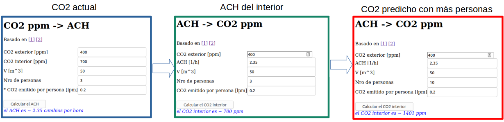

En la figura, se muestra un ejemplo del uso de [una calculadora online](https://droyktton.github.io/loscoihues/ventilacion/CO2ACHProbInfeccionV3.html)  para hacer predicciones. **Izquierda**: Supongamos que medimos unos 700 ppm en un dado interior de 50 m3 de volumen donde hay tres personas realizando una actividad que los lleva a emitir 0.2 litros por minuto de CO2 (ver 
[tabla](https://droyktton.github.io/loscoihues/ventilacion/CO2ACHProbInfeccionV3.html) de emisiones según actividad). Entonces el número de cambios de aire por hora es ACH=2.35 aproximadamente. **Medio**: Podemos verificar que ese valor de ACH es consistente con los ppm de CO2. **Derecha**: conocido el ACH, y asumiendo razonablemente que este no cambia cambiando el número de personas adentro, podemos estimar la concentración que habría si hay diez personas realizando el mismo tipo de actividad en vez de tres, obteniendo el valor de 1401 ppm de CO2. 

Muchos más detalles y ejemplos ilustrativos de este tipo de cálculos y otros análisis interesantes en **aulas de enseñanza** pueden encontrarse por ejemplo [aquí](http://www.jorgealiaga.com.ar/wp-content/uploads/2021/02/Estudio-Ventilacion-IES-Aldonza-Lorenzo-1.pdf) o [aquí](https://www.csic.es/sites/www.csic.es/files/guia_para_ventilacion_en_aulas_csic-mesura.pdf). 
 
## ¿Estoy ventilando bien?
La recomendación general para tener una concentración de CO2 baja es mantener un número de cambios de aire por hora suficientemente alto. Para ello, la forma más eficiente es mantener una ventilación cruzada, continua, y distribuída. Sin embargo cada interior tiene sus características, sus aberturas, su volumen, sus conexiones con otros espacios, un exterior de ciertas características, y un número de ocupantes realizando determinadas actividades. Está entonces claro que la ventilación que funciona en un lugar puede no ser adecuada en otro lugar. En particular, si la temperatura exterior es muy baja por ejemplo, no podremos aplicar una ventilación natural exagerada, por el frío. Por todo esto es que la ventilación tiene que ser también **medida**. Medir en el lugar y momento concretos nos permite responder a las preguntas: ¿Está en este momento bien ventilado mi ambiente?, ¿Qué puedo hacer para mejorar la ventilación de mi sala compartida? La medición de CO2 nos permite experimentar distintas condiciones de ventilación hasta encontrar la adecuada, sin necesidad de recurrir a complicados modelos matemáticos que dependen de muchas características propias del interior y su entorno.

La recomendación práctica de los expertos es entonces que la ventilación sea [continua, cruzada, distribuída y medida](https://www.argentina.gob.ar/sites/default/files/covid-19-prevencion-de-transmision-por-aerosoles-2021_0.pdf). Los medidores de CO2 nos permiten alcanzar el último objetivo, y de hecho, basta experimentar un poco con un medidor en interiores para concluir que la ventilación óptima es de hecho siempre cercana a la de la recomendación general.

## Preguntas frecuentes
No sé si todo, pero casi todo lo que uno querría saber y no se atreve a preguntar sobre la transmisión de covid19 por aerosoles, lo puede encontrar en estas extensas  [FAQ](https://docs.google.com/document/d/1fB5pysccOHvxphpTmCG_TGdytavMmc1cUumn8m0pwzo/edit#), y encontrar numerosos enlaces a las publicaciones más relevantes.

## Argentina
Para reducir los riesgos de contagio en interiores, que es donde suelen ocurrir la mayoría de los contagios, incluidos los peligrosos eventos de superpropagación de la enfermedad, es muy importante que aprendamos a ventilar, y que compartamos rápida y abiertamente los conocimientos y la experiencia, y que generemos más conciencia. Para más información, particularmente referida a Argentina, recomendamos visitar la [campaña ventilar](https://www.argentina.gob.ar/ciencia/unidad-coronavirus/ventilar).

___

# Medidor
 
## Funcionalidad 
El medidor muestra la concentración de CO2, la temperatura y la humedad relativa, en una pantalla. Los *errores* aleatorios y sistemáticos esperables en cada una de estas lecturas está bien descripto en el manual del sensor [Sensirion SCD30](https://cdn.sparkfun.com/assets/d/c/0/7/2/SCD30_Interface_Description.pdf). Si la concentración de CO2 supera un umbral también sonará una chicharra cada pocos segundos, a modo de *alarma sonora*. Los mismos datos que muestra la pantalla son impresos en el puerto serial para otros posibles usos, como monitoreo externo o remoto. Apretando un pulsador podemos iniciar una *rutina de calibración forzada*, opcional, que se realiza siguiendo las instrucciones de la pantalla, en particular la de esperar unos minutos en el exterior con el medidor encendido. El medidor se alimenta con 5V o 9V, para lo cual se puede usar un cargador enchufado, o una batería. Con la batería propuesta el medidor, funcionando a pleno, tiene una *autonomía* de más de 24hs de uso. Con baterías normales de 9V se tiene mucho menos autonomía.

## Uso
Es importante *colocar el medidor* lejos de las personas y no obstruir sus conductos de ventilación traseros que permiten que el aire circule libremente a través del sensor. En el caso que alguien respire muy cerca del medidor, será necesario esperar por un par de minutos hasta que el aire se mezcle y la medida ambiental se reestabilice. También es importante asegurarse de que no haya fuentes de CO2 que no provengan de la respiración de los ocupantes (hornos, hornallas, etc), caso contrario las advertencias en la pantalla no serán válidas. 

El *procedimiento* que recomendamos, basado en la opinión de algunos expertos, es empezar con una configuración que tenga en lo posible una ventilación natural continua, cruzada y distribuída. Si el medidor indica que hay que ventilar, será necesario abrir un poco más puertas y/o ventanas hasta que la concentración de CO2 baje nuevamente a valores de riesgo bajo. Sorprendentemente no es necesario exagerar: ¡a veces unos pocos centímetros más de apertura hacen una gran diferencia! Y es necesario esperar unos minutos después de cada cambio antes de realizar el siguiente. Recordar que el grado de ventilación dependerá del número de personas, de sus actividades, del volumen del espacio interior y posiblemente también de las diferencias de presión y temperatura entre exterior e interior. Para estar seguro en estas condiciones cambiantes es recomendable medir frecuentemente.

En algunos casos se han usado ventiladores para forzar la salida de aire y mejorar el intercambio con el exterior. En algunos edificios existen ya ductos de ventilación forzada, que podrían o no incluir filtros de aerosoles. En cualquier caso los expertos recomiendan medir CO2 para asegurarse de que la capacidad instalada esté funcionando correctamente. Lo bueno es que cualquier otra propuesta creativa para mejorar la ventilación de un lugar concreto con características propias, podrá ser seleccionada por el medidor. 

Si fuera necesario *recalibrar*, esto se puede lograr apretando el pulsador hasta escuchar un sonido. Desde ese momento y por unos dos minutos el medidor deberá permanecer en el exterior lejos de fuentes de CO2. La pantalla mostrará una cuenta regresiva hasta que el medidor esté listo. Cuando está listo el medidor se puede llevar al interior. No es necesario mantener prendido el medidor todo el tiempo, ya que la última calibración se guarda en memoria no volátil.
Si por accidente se apretara el botón en circunstancias no controladas, será necesario presionarlo de nuevo para reiniciar prolijamente el simple proceso de recalibración recién descripto.

*Contraindicaciones: el uso prolongado del medidor puede provocar una obsesión por medir la calidad del aire en absolutamente todos lados.* 

## Lista de Componentes 
1. Placa [Arduino UNO](https://es.wikipedia.org/wiki/Arduino_Uno) x **1**.
2. Entradas: 
   1. Módulo Sensor de CO2, humedad y temperatura [Sensirion SCD30](https://cdn.sparkfun.com/assets/d/c/0/7/2/SCD30_Interface_Description.pdf)  x **1**. Un posible [importador a Argentina](https://ar.mouser.com/ProductDetail/Sensirion/SCD30/?qs=rrS6PyfT74fdywu4FxpYjQ%3D%3D). Este es el componente más importante que recomendamos adquirir primero. Tener en cuenta de que hay otros [proyectos](#proyectos-parecidos) con sensores NDIR diferentes.   
   2. [Pulsador](https://articulo.mercadolibre.com.ar/MLA-831826308-mini-pulsador-nc-na-metal-1a-250v-rojo-negro-_JM?searchVariation=48395399536#searchVariation=48395399536&position=10&search_layout=stack&type=item&tracking_id=953b5afb-9dc7-4574-b4a3-8c5bc287dfb3)  x **1**. 
3. Salidas:
   1. Pantalla [LCD I2C 16x2](https://aprendiendoarduino.wordpress.com/2018/10/17/pantalla-lcd-i2c-en-arduino/)  x **1**.
   2. Audio: Zumbador o [buzzer pasivo](https://articulo.mercadolibre.com.ar/MLA-855477829-buzzer-pasivo-zumbador-tonos-raspi-arduino-pack-x-10-_JM)  x **1**.
   3. Puerto Serial USB del Arduino UNO.
6. Alimentación: 
   1. Cargador Portátil [Gadnic BC-26 10000 mAh de Carga Rápida USB con Indicador de Batería](https://www.gadnic.com.ar/cargadores-portatiles/mini-power-bank-gadnic-10000mah-celular-portable-carga-rapida?source=shopping&gclid=Cj0KCQjwpdqDBhCSARIsAEUJ0hNEWgSMh8Dhvq2dokc-VR9O0HjDaYrEMnrP-C9cRBaNrsn3jscANYYaAntUEALw_wcB)  x **1**.
   2. Alternativamente, se puede usar el puerto USB o la entrada de 9V del Arduino UNO, enchufados a una fuente de alimentación.
8. Gabinete: Cajas de Luz adaptadas  x **1**.
9. Otros accesorios: 
   1. [Mini Protoboard adhesiva de 170 Puntos](https://articulo.mercadolibre.com.ar/MLA-732244755-mini-protoboard-170-puntos-electronica-experimental-arduino-_JM?matt_tool=88481412&matt_word=&matt_source=google&matt_campaign_id=11618987428&matt_ad_group_id=113657532672&matt_match_type=&matt_network=g&matt_device=c&matt_creative=479785004862&matt_keyword=&matt_ad_position=&matt_ad_type=pla&matt_merchant_id=151751194&matt_product_id=MLA732244755&matt_product_partition_id=353037831509&matt_target_id=aud-416637721346:pla-353037831509&gclid=Cj0KCQjw78yFBhCZARIsAOxgSx3r4aBWp5LLAuv8au6MtcoLOjKKyF1T4pTUQ9VDEvXlwKXRzFdaztoaAka4EALw_wcB)  x **1**.
   2. Cables Dupont Macho Hembra y Macho Macho de 20cm x **30**. 
   3. "Peines" [Tira Pines Macho 1x40 Paso 2.54mm Largo 11mm](https://articulo.mercadolibre.com.ar/MLA-856724875-tira-pines-macho-1x40-paso-254mm-largo-11mm-pack-x-10-_JM?matt_tool=88481412&matt_word=&matt_source=google&matt_campaign_id=11618987428&matt_ad_group_id=113657532672&matt_match_type=&matt_network=g&matt_device=c&matt_creative=479785004862&matt_keyword=&matt_ad_position=&matt_ad_type=pla&matt_merchant_id=214357370&matt_product_id=MLA856724875&matt_product_partition_id=353037831509&matt_target_id=aud-416637721346:pla-353037831509&gclid=Cj0KCQjw78yFBhCZARIsAOxgSx2fx4KlgKT8XJ12dwbPWXIHZH7ti3DfmetLhYyTJxpGava6vAcQRXwaAp1yEALw_wcB) **1**.
   4. Resistencia 10 kOhm x **1**.

Los links son solo referencias a las componentes, no recomendaciones de sitios de compra.

## Circuito
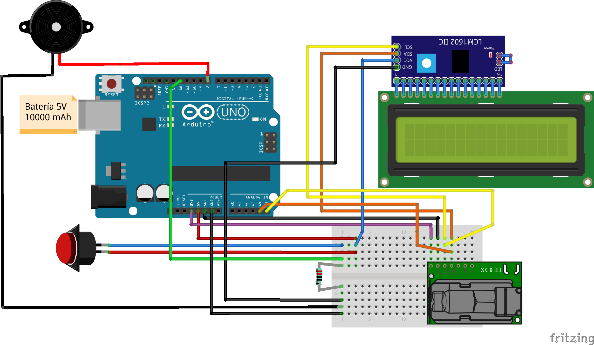
Como se puede ver, se usa un resistor "pull down" con el pulsador de recalibración, los pines A4/A5 van respectivamente al SDA/SCL de ambos, el LCD I2C y el SCD30, la chicharra o buzzer pasivo es controlada con el pin digital 8, y la batería se conecta al USB del Arduino. Notar que el SCD30 está alimentado con la salida de 3.3V. Los "Peines" o tira de pines se soldaron a los conectores (VCC,SDA,SCL,GND) del sensor SCD30, para poder luego conectarlo a la miniboard. 

## Software

+ Todos los códigos están en [esta carpeta](https://github.com/droyktton/medidorCO2/tree/main/medidoresIB/src).

+ [El código fuente que controla la placa Arduino](./medidoresIB/src/medidoresIB.ino) fue escrito usando el [open-source Arduino Software (IDE)](https://www.arduino.cc/en/software) en Ubuntu 20.04 linux. Para interactuar con el sensor NDIR usamos la biblioteca [SparkFun_SCD30_Arduino_Library](https://github.com/sparkfun/SparkFun_SCD30_Arduino_Library). Para interactuar con la pantalla LCD I2C usamos la biblioteca [liquid-crystal-i2-c](https://www.arduinolibraries.info/libraries/liquid-crystal-i2-c). 

+ *"Data logger":* El presente medidor es sencillo, no tiene conexión bluetooth ni wifi, y solo podemos comunicarnos con el vía USB. Una vez conectado el medidor, el Arduino IDE tiene un "serial monitor" e incluso un "serial plotter", pero no encontré la forma de que grabe un archivo automáticamente. El código [leerserial.py](https://github.com/droyktton/medidorCO2/blob/main/medidoresIB/leerserial.py) se provee para el caso de que uno quiera leer el puerto serial conectando la computadora al medidor vía USB. Está escrito en python usando la biblioteca [pyserial](https://pyserial.readthedocs.io/en/latest/pyserial.html#installation). Este programa lee los datos que la placa imprime en el puerto serial y los va volcando a un archivo "medidor.dat" que contiene toda la serie temporal de mediciones de concentración de CO2, temperatura, y humedad, en función del tiempo absoluto y relativo al comienzo de la medición. Una idea naive pero sencilla para hacer *monitoreo remoto* sería dejar el medidor conectado via USB a una computadora conectada a internet, lanzar en esta última el script  de python provisto [leerserial.py](https://github.com/droyktton/medidorCO2/blob/main/medidoresIB/src/leerserial.py) en background y con otro script (o completando el script de python para que lo haga también), copiar cada tanto el archivo de salida "medidor.dat" a un repositorio compartido en la nube (github, dropbox, etc). Se podría incluso compartir directamente el gráfico del monitoreo en tiempo real ploteando los datos en una página web usando, por ejemplo, [plotly javascript](https://plotly.com/javascript/). Por ejemplo, con [este](https://github.com/droyktton/medidorCO2/blob/main/medidoresIB/src/dibujo.html) código, uno puede generar plots de [este tipo](https://droyktton.github.io/loscoihues/ventilacion/dibujo.html) en una página web pública, e ir enviando actualizaciones a intervalos regulares.  

## Ensamblaje
[comment]: <> (This is a comment, it will not be included)

Como gabinete usamos una caja de luz plástica, con varias aberturas traseras para dejar circular el aire a través del sensor de CO2. 
Comprobamos que las mediciones estacionarias con y sin el gabinete eran indistinguibles dentro del error esperando del sensor (de 30 ppm  aproximadamente).
Nos resultó muy útil en el ensamblado que la miniboard sea, además de pequeña, adhesiva. En caso de necesitar cambiar el preset de su backlight, el LCD se accede fácilmente sacando la tapa superior y aflojando sólo dos tornillos. A contiunación fotos del ensamblado de todas las partes.

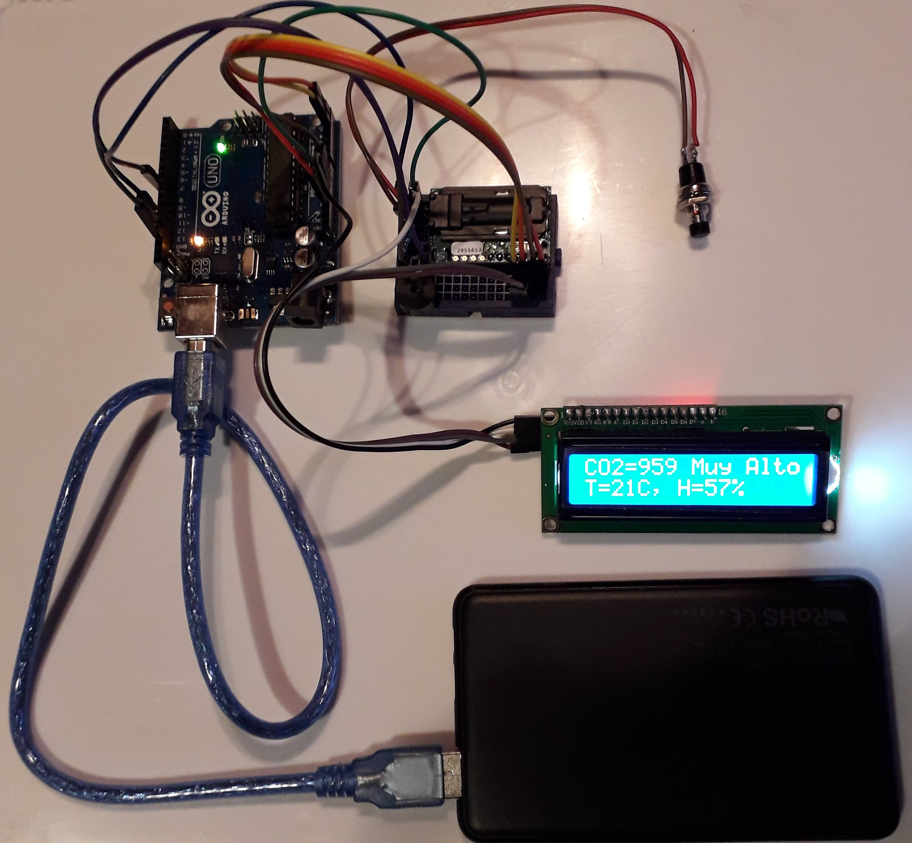
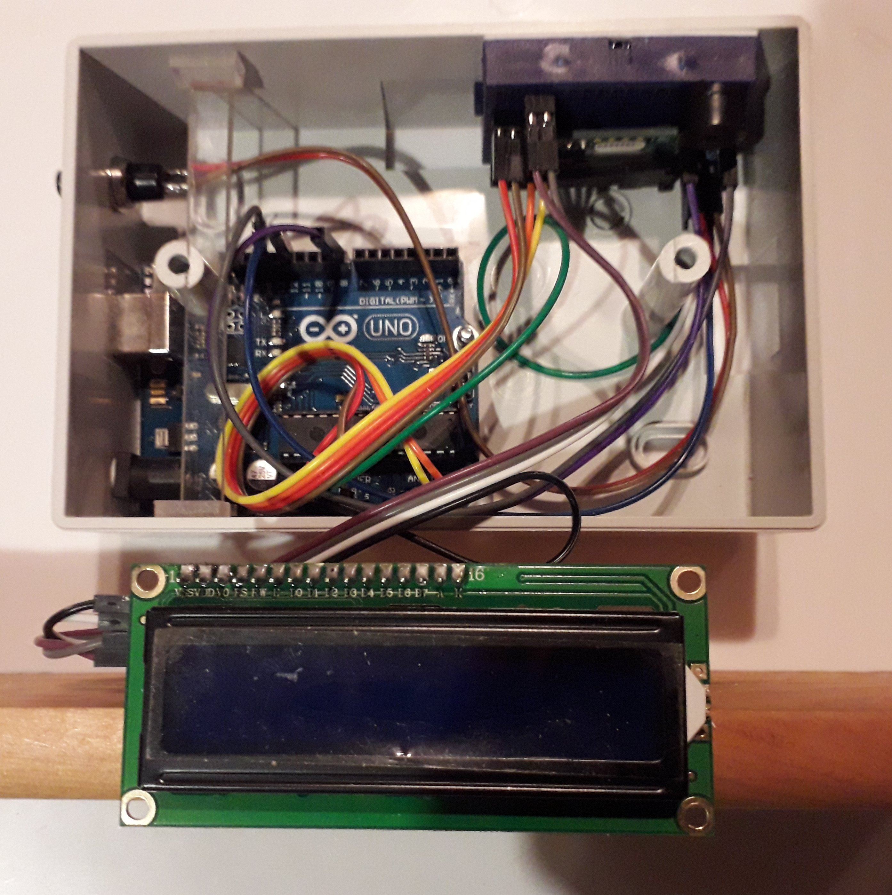
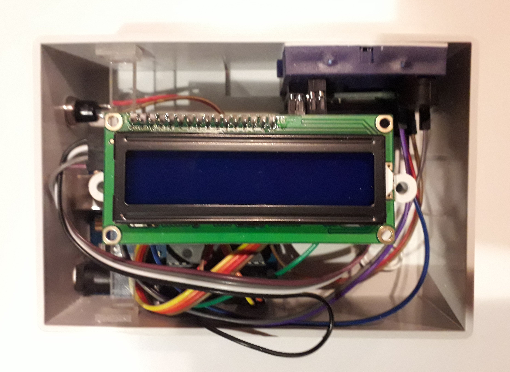
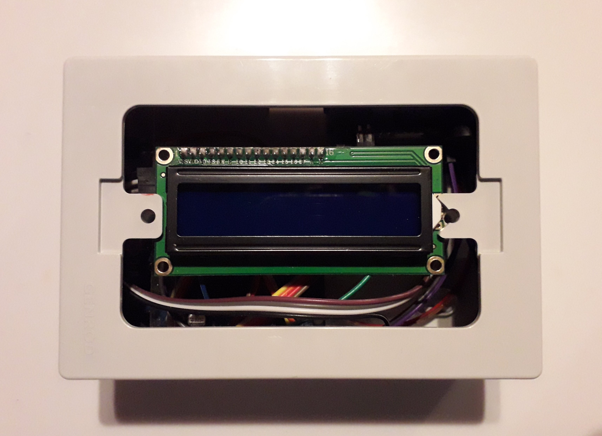
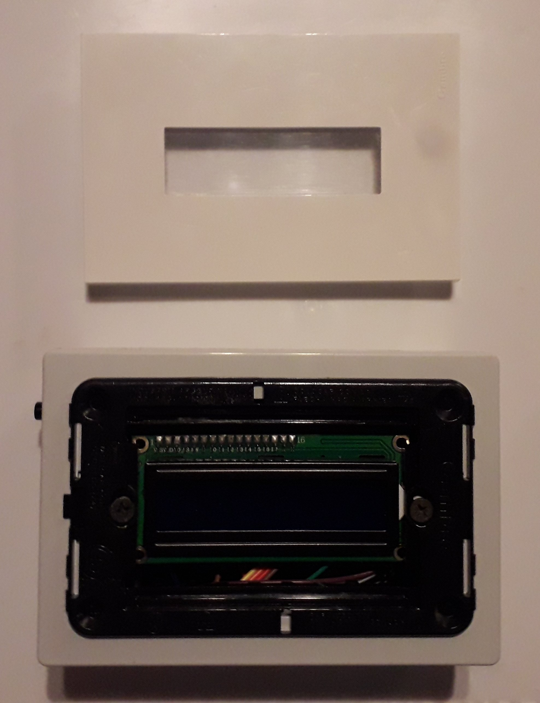
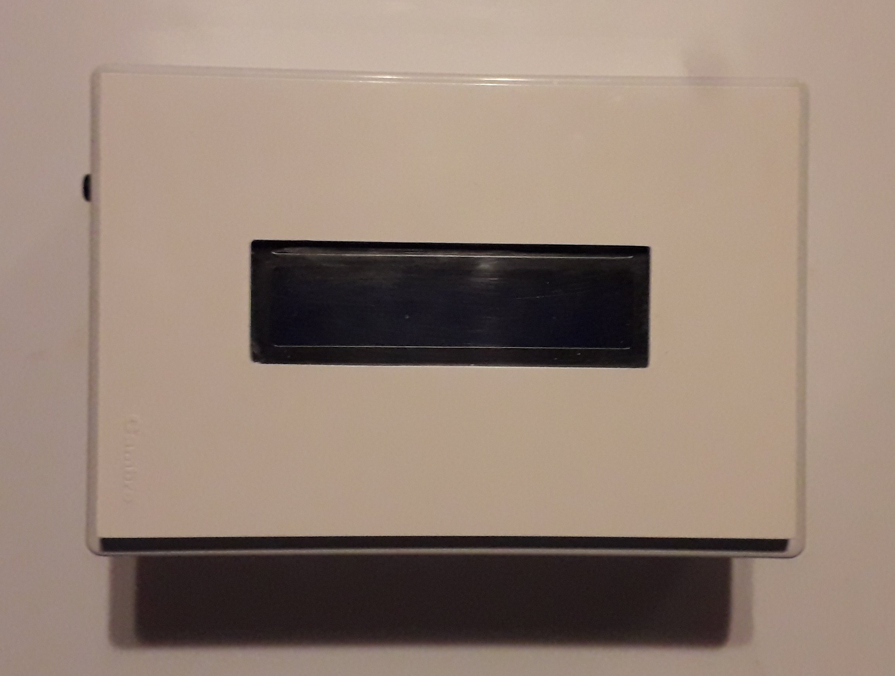
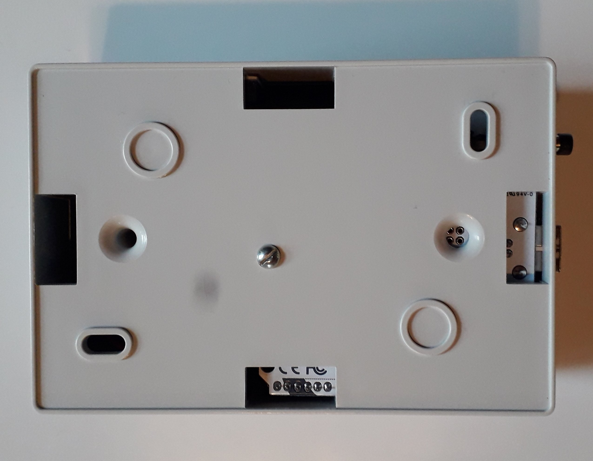
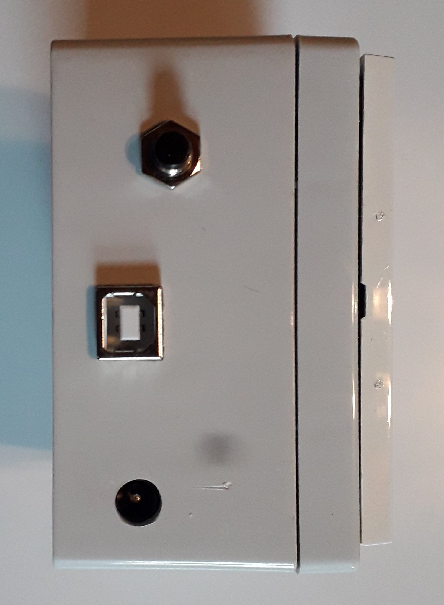
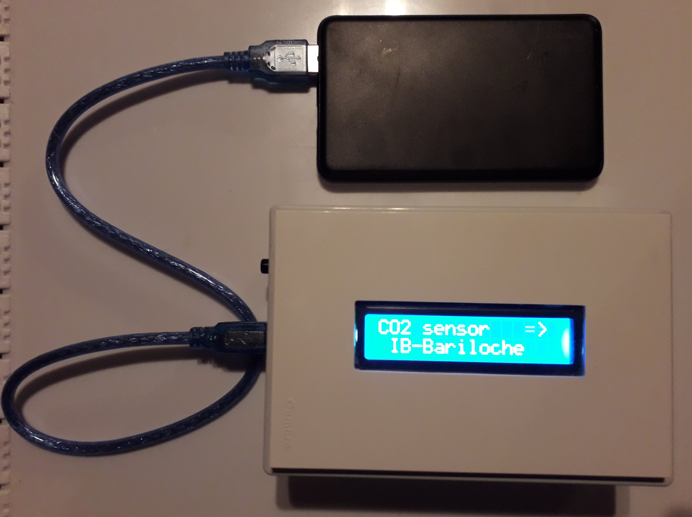

___

# Proyectos Parecidos

Hay proyectos de medidores que usan por ejemplo sensores electroquímicos de CO2 o similares. Son más económicos, pero son menos específicos al CO2 y en general más difíciles de calibrar que los NDIR. Esta es un pequeña selección de proyectos de medidores que usan sensores NDIR de distintos tipos. 

+ https://github.com/jlaliaga/Medidor-de-CO2
+ https://www.instructables.com/CO2-Sensor-for-Schools/ 
+ https://emariete.com/medidor-casero-co2/
+ https://github.com/danielbernalb/LibreCO2/blob/main/INSTRUCCIONES%20en%20Espa%C3%B1ol.md
+ https://github.com/Sensirion/arduino-ble-gadget/blob/master/documents/SCD30_Monitor_Tutorial.md
+ https://github.com/anaireorg/anaire-devices
+ https://fablab.ruc.dk/co2/
+ https://github.com/Alitux/solarco2

# Agradecimientos

+ A Pierre Arneodo Larochette por diseñar y armar los gabinetes, y por el ensamblado final.
+ A Eduardo Jagla por la motivación, la experimentación, y la discusión.
+ A Luciano Lamaita y Jorge Aliaga por compartirme generosamente numerosos tips técnicos y prácticos.
+ Al Instituto Balseiro por apoyar la iniciativa. 
+ ¡A las escuelas de Bariloche que van aceptando medir en sus aulas! 

# Contacto 
Sugerencias, correcciones y preguntas son muy bien bienvenidas.
@droyktton en twitter o gmail.

